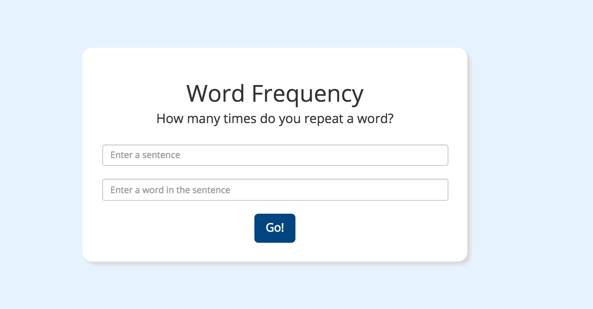

# Word Frequency

#### A web app that determines how many times a particular word is used in a sentence. 9/16/2016

#### By _**Aimen Khakwani**_

## Description

This website takes two inputs from the user, a sentence and a word, and returns the number of times the word appears in the sentence.

## Setup/Installation Requirements

* Clone the repository
* Using the command line, navigate to the project's root directory
* Install dependencies by running $ composer install
* Navigate to the /web directory and start a local server with $ php -S localhost:8000
* Open a browser and go to the address http://localhost:8000 to view the application

## Specifications

* The program takes two user inputs and returns a number
    * Example Input: "Hello world", "Hello"
    * Example Output: 1
    * Why: This input and output will confirms first and foremost that the program can return a number without any errors.
    * How to test: Simply have the method return a number 1 regardless of input.

* The program evaluates user input and returns the correct number of times the word is used in the sentence
    * Example Input: "jelly beans jelly beans", "beans"
    * Example Output: 2
    * Why: This input and output will test that the program is correctly evaluating user input, and storing and returning the correct value.
    * How to test: Input a simple sentence like the once above and have an expected outcome of 2.

* The program is able to evaluate user input regardless of capitalization
    * Example Input: "Why hello to You, and you, and you", "you"
    * Example Output: 3
    * Why: This will ensure that the program is able to work even if users enter a sentence or a word that aren't consistent in capitalization
    * How to test: Enter an input that begins with a capitol letter and confirm that the program works.

* The program ignores special characters like commas and periods.
    * Example Input: "Hi Emma. How are you, are feeling better?" "are"
    * Example Output: 2
    * Why: This will ensure that the program is able to work even if users enter a question marks, commas and periods
    * How to test: Enter an input that has special characters and ensure the program still returns a correct value.

# Known Bugs

There are no known bugs at this time.

## Technologies Used

* _PHP_
* _Silex_
* _Twig_
* _Bootstrap_
* _HTML_
* _CSS_

## License

*This website is licensed under the MIT license.*
Copyright (c) 2016  **_Aimen Khakwani_**
